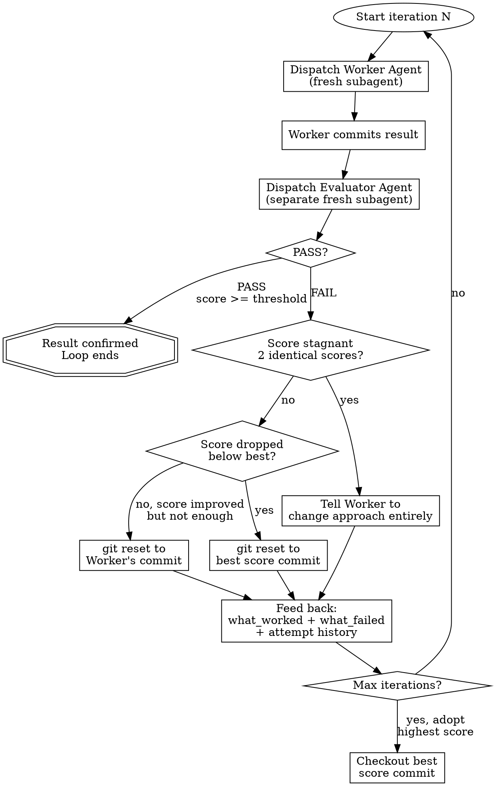

# Self-Refining Loop

## Overview

Worker builds, Evaluator judges, Orchestrator decides. No shared context between Worker and Evaluator — independent evaluation prevents confirmation bias.

## When to Use

- Result quality matters more than speed
- Clear (or derivable) evaluation criteria exist
- Task benefits from iterative refinement (code, docs, refactoring)
- User says "refine", "iterate", "optimize", "반복 개선", "자가 피드백"

**When NOT to Use:**
- Simple one-shot tasks (bug fix with obvious solution)
- No meaningful quality metric exists
- Task is exploratory/research (no clear "better")
- User needs speed over quality

## Architecture

```
User → Orchestrator (you) → Worker Agent (fresh subagent)
                           → Evaluator Agent (separate fresh subagent)
                           → FAIL → rollback + feed back → Worker retry
                           → PASS → result confirmed
```

**Context isolation is non-negotiable.** You MUST use the `Agent` tool to dispatch Worker and Evaluator as separate subagents. Do NOT perform Worker or Evaluator work directly in the Orchestrator context. This prevents confirmation bias — the Evaluator must judge the result without knowing the Worker's reasoning.

**This skill must be executed by the main session (top-level), not delegated to a subagent.** Subagents cannot dispatch nested Agent calls, making Worker/Evaluator isolation impossible.

## Parameters

| Parameter | Default | Description |
|-----------|---------|-------------|
| `max_iterations` | 3 | Maximum Worker-Evaluator cycles |
| `pass_threshold` | 7 | Minimum score (0-10) for PASS verdict |

User can override: "iterate up to 5 times", "pass threshold 8".

## The Process

### Step 0: Establish Evaluation Criteria

If the user provides explicit criteria, use them. If not, auto-generate based on task type:

| Task Type | Auto-Generated Criteria |
|-----------|------------------------|
| Code implementation | Test passage, correctness, code quality, requirement coverage |
| Documentation | Accuracy, completeness, clarity, structure |
| Refactoring | Existing tests pass, complexity reduction, readability |
| UI/Design | Visual consistency, responsiveness, accessibility |

Auto-generated criteria are used immediately without user confirmation. The loop runs autonomously — no mid-process checkpoints or approval steps.

### Step 0.5: Pre-flight

Before the loop begins:
1. **Verify test command**: Run tests once to confirm they pass and identify the correct command. Monorepos may require running from a subdirectory.
2. **Identify protected files**: Test files and config files should NOT be modified. Tell the Worker explicitly.
3. **Populate template variables**:
   - `KEY_FILES`: source files in the target directory (exclude tests, configs)
   - `ADDITIONAL_CONTEXT`: project CLAUDE.md, relevant test files (read-only context)
   - `TEST_COMMAND`: the verified command from step 1
   - `CHANGED_FILES_LIST`: `git diff --name-only $CHECKPOINT_COMMIT..HEAD` (for Evaluator)

### Step 1: Create a Safety Checkpoint

```bash
CHECKPOINT_COMMIT=$(git rev-parse HEAD)
```

If working tree is dirty (`git status --porcelain` non-empty), `git stash` first. Otherwise skip stash.

### Step 2: The Loop



#### 2a. Dispatch Worker Agent

Use `worker-prompt.md` template. The Worker:
- Gets: task description, evaluation criteria, codebase context
- On iteration N > 1: also gets full attempt history with scores, feedback, what_worked, what_failed
- Performs the work using all available tools (Read, Edit, Write, Bash, Grep, Glob)
- Runs tests first. If tests fail, does NOT commit — reports failure and retries
- Commits only changed source files (not `git add -A`): `git add <changed files> && git commit -m "refine: iteration N - [description]"`

**Worker dispatch example:**

```
Agent(
  prompt: [built from worker-prompt.md template],
  description: "Worker iteration N"
)
```

#### 2b. Dispatch Evaluator Agent

Use `evaluator-prompt.md` template. The Evaluator:
- Gets: evaluation criteria, list of changed files (from git diff), pass_threshold
- Does NOT get: Worker's reasoning, previous Evaluator outputs, attempt history
- Reads the actual code/files independently
- Returns structured evaluation (see Evaluator Return Format below)

**Evaluator dispatch example:**

```
Agent(
  prompt: [built from evaluator-prompt.md template],
  description: "Evaluator iteration N"
)
```

#### 2c. Process Evaluator Result

Parse the Evaluator's structured response:

**If PASS (verdict=PASS, score >= pass_threshold):**
- Loop ends. Result confirmed.
- Report final score and dimension breakdown to user.

**If FAIL:**
- Apply convergence strategy (see below)
- If max_iterations not reached, go to 2a with updated history

### Step 3: Max Iterations Reached

If loop exhausts max_iterations without PASS:
- Find the attempt with the highest score
- `git checkout` that attempt's commit
- Report to user: "N회 반복 후 최고 점수 [X]/10인 시도 #[M]을 채택했습니다."
- Show dimension breakdown of adopted attempt

## Evaluator Return Format

The Evaluator MUST return a response parseable into this structure:

```
VERDICT: PASS | FAIL
SCORE: 0-10
DIMENSIONS:
  - correctness: 0-10
  - completeness: 0-10
  - quality: 0-10
  - [task-specific dimensions]
WHAT_WORKED:
  - [specific things to keep]
WHAT_FAILED:
  - [specific things to fix or discard]
FEEDBACK:
  - [concrete, actionable improvement instructions]
```

## Convergence Strategy

Inspired by autoresearch's experiment loop:

| Situation | Action |
|-----------|--------|
| Score improved but < threshold | Normal retry with feedback |
| Score identical 2 consecutive times | Tell Worker to change approach entirely (not incremental tweaks) |
| Score dropped below previous best | `git reset` to best score commit, then retry with different direction |
| Tiny improvement + complexity increase | Treat as FAIL (simplicity criterion) |

## Simplicity Criterion

From autoresearch: "A small improvement that adds ugly complexity is not worth it."

If Evaluator reports score improved by <= 1 point but complexity increased significantly, Orchestrator overrides to FAIL and instructs Worker to find a simpler path.

## Git-Based Experiment Tracking

Each iteration is a commit. This enables:
- Rollback on failure: `git reset --hard <previous_commit>`
- Adopt best attempt: `git checkout <best_commit>`
- Full history visible in `git log`

**Commit message format:** `refine: iteration N - [brief description of changes]`

## Prompt Templates

- **Worker prompt:** See `worker-prompt.md` in this directory
- **Evaluator prompt:** See `evaluator-prompt.md` in this directory

Build prompts by filling template variables from the current loop state.

## Example Scenario

**User:** "이 API 모듈을 리팩토링해줘. 반복 개선해서 품질 높여줘."

1. Orchestrator auto-generates criteria: tests pass, complexity reduction, readability, no behavior change
2. User confirms criteria
3. **Iteration 1:** Worker refactors → commits → Evaluator scores 5/10 (tests pass but complexity not reduced)
4. **Iteration 2:** Worker gets feedback "extract helper functions, reduce nesting" → refactors → commits → Evaluator scores 7/10 → PASS
5. Orchestrator reports: "2회 반복, 최종 점수 7/10. correctness: 9, completeness: 7, quality: 6"

## Common Mistakes

| Mistake | Fix |
|---------|-----|
| Sharing context between Worker/Evaluator | Always use fresh Agent() calls — never SendMessage |
| Evaluator sees Worker's reasoning | Only pass file paths and diff, not Worker's output text |
| No git commit before evaluation | Worker MUST commit before Evaluator runs |
| Forgetting attempt history on retry | Include ALL previous attempts' scores + feedback |
| Not rolling back on score drop | Always reset to best commit when score regresses |
